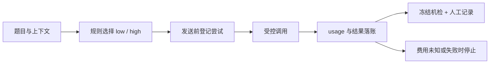

# 模型路由与成本质量评测

用同一份任务和上下文，比较全用低成本模型、全用高成本模型、按规则路由三条路线的费用与回答。项目实现可解释路由、尝试台账、未知费用停止和冻结判据评测，全部使用 Python 标准库。

| 内容 | 入口 |
|---|---|
| 设计与运行链路 | [项目说明](docs/PROJECT.md) |
| 数字、失败案例与分母 | [结果与评测](docs/EVALUATION.md) |
| 零模型调用复现 | [运行指南](docs/QUICKSTART.md) |
| 文件与数据导航 | [文档索引](docs/README.md) |
| 来源、许可、公开范围 | [NOTICE](NOTICE.md) |



当前结果：

| 实验 | 已有证据 | 可以说明的结论 |
|---|---|---|
| M1 开发集两档 | 每档6题；机检各5/6；人工记录合成各5/6 | high折算费用为low的24.79倍，所列判定一致；样本不足以外推 |
| M2 v3-02三组 | 71/90次尝试，70条回答，19项未执行 | 已知折算费用¥0.4497296，未知1次，总费用null；完整对照未完成 |
| M2需要人工的40条回答 | 机检30/40、事后语义登记38/40、算术合取28/40 | 35条按口径回填，5条边界项据登记由用户逐条阅读；未运行collect/derive |
| 共同T01–T20的局部成本 | low ¥0.0067494 / high ¥0.2606200 / route ¥0.1017146 | route相对high低60.97%，相对low为15.07倍；不能写成同质量降本 |

## 离线运行

Python 3，无第三方依赖。克隆仓库后在项目根目录运行：

```bash
python verify_m1.py
python verify_m2.py
python tools/build_scoring_candidate_v3.py --out output/rebuilt_test_v4.json --criteria-out output/rebuilt_criteria_m2_v3.json --report output/build_report.json
python tools/verify_scoring_candidate_v3.py --report output/verify_report.json
```

前两项只启动本机回环测试服务；后两项读取冻结样例。离线校验不访问模型。测试输出写在被忽略的`runs/`中。

## 当前边界

全部题目为合成材料；M1为开发集，M2中断后不补跑。价格来自历史快照，费用是折算值；未知值保留null。高档32个响应均报告思考token，请求中`enable_thinking=false`未证明实际关闭思考。D09历史题面未发送200字符上限，不能由其超长结果推断受限摘要能力。

评分候选`test_v4 / criteria_m2_v3`通过离线校验，仍为candidate，未用于新真实实验，未改写历史评分。事后语义登记可供诊断，没有完成全量盲评，不能外推模型质量等价或通用最优路由。

真实入口需要新的有效批准记录、与记录相同的现场身份及显式确认。公开包不包含可执行的历史批准文件。

主要入口：[router.py](router.py)、[runner.py](runner.py)、[m2_batch.py](m2_batch.py)、[m2_reconcile.py](m2_reconcile.py)、[grade.py](grade.py)。
